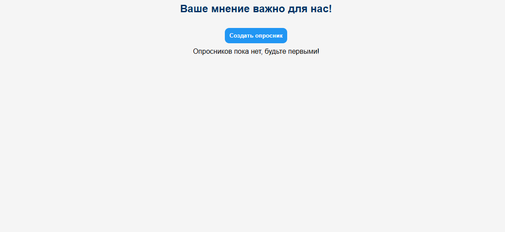
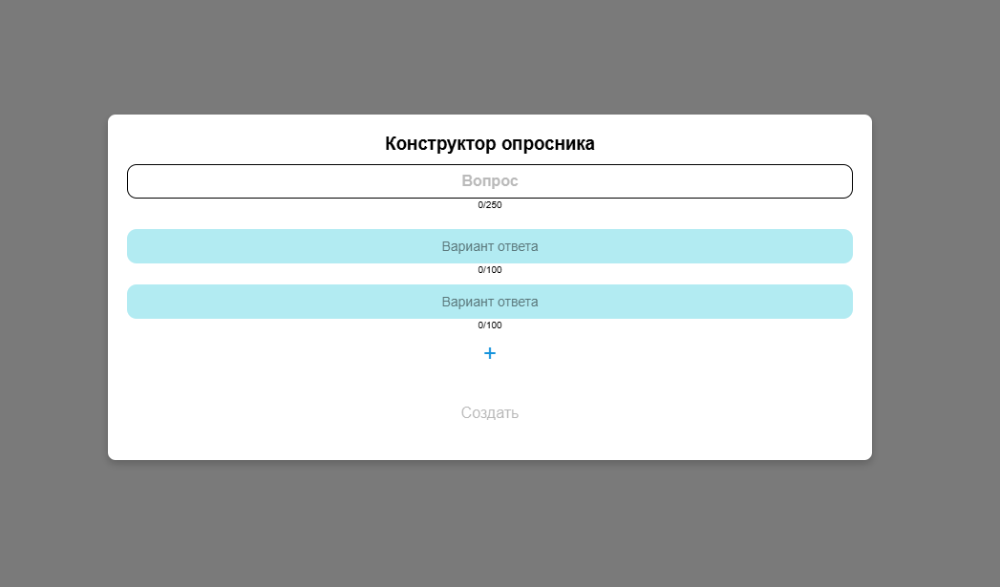
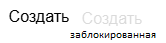
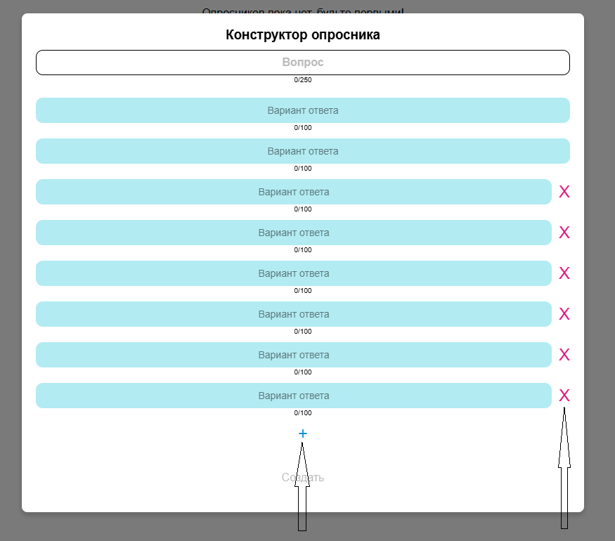
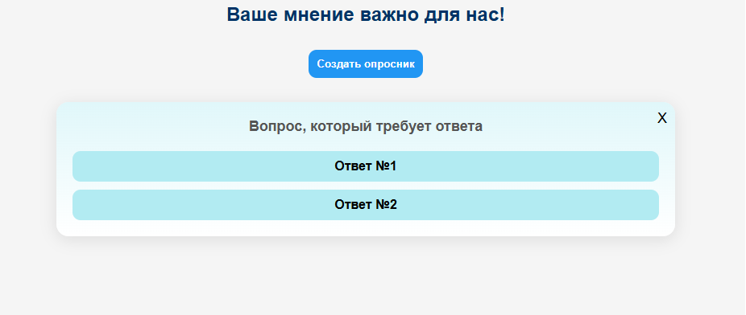
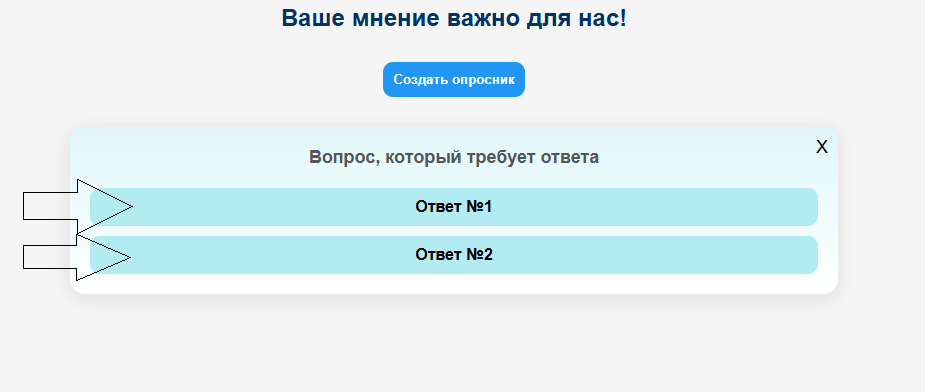
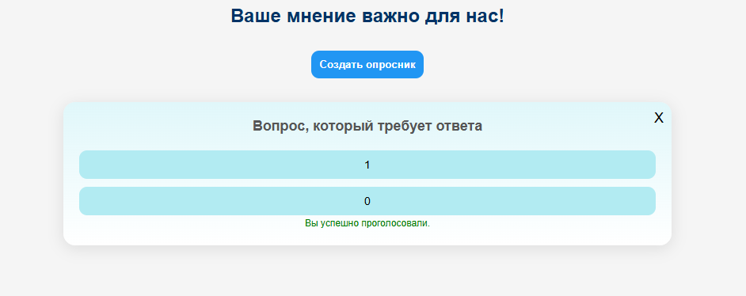
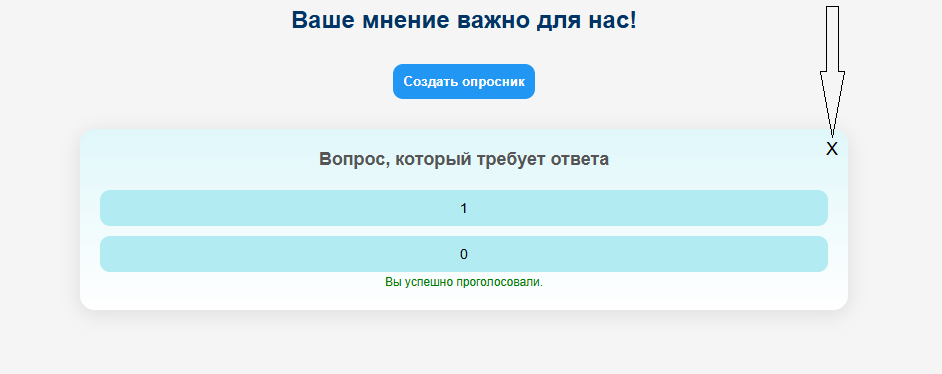
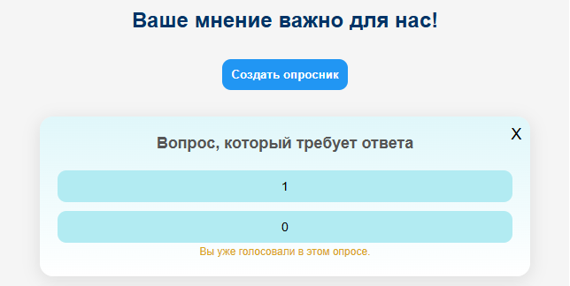

## InterPolls

---

### [Общая информация](#общая-информация-1)

### [Инициализация](#инициализация-1)

1.  #### [Cкачивание репозитория](#скачивание-репозитория)
2.  #### [Инициализация приложения](#инициализация-приложения-1)

### [Инструкция](#инструкция-1)

1.  #### [Инструкция для пользователя](#инструкция-для-пользователя-1)
2.  #### [API документация](#api-документация-1)

---

### Общая информация

Данное приложение предназначено для создания и участия в интерактивных опросах. Пользователи могут создавать опросы, голосовать и просматривать результаты без авторизации.

[Инициализация](#инициализация-1) и [Инструкция](#инструкция-1) по приложению находятся в соответствующих заголовках.
В этом разделе дальше пойдет описание используемых технологий и реализованных функций.

Во всем приложении используется `TypeScript`, как на Frontend, так и на Backend.
Также имеется файл `docker-compose` для контейниризации и удобного запуска данных сервисов.

Основной технологией, используемой для написания Backend, является фреймворк `NestJS`. Для хранения информации об опросах используется база данных `PostgreSQL`. Для более удобного взаимодействия между БД и API используется `TypeORM`.

Маршруты API указаны в [API документация](#api-документация-1). Также запускается прослушивание подключения по `WebSocket` для реализации механизма обновления данных, чтобы несколько пользователей могли видеть изменение количества голосов, добавление и удаление опросов в реальном времени.

Для валидации данных, поступающих на Backend, используется `class-validator` и `class-transformer`.

База данных имеет одну таблицу `poll`. В нем определены три свойства: `id`, `question` и `options`.
`id` - стандартный уникальный идентификатор опроса, `question` - вопрос, обозначенный в опросе, `options` - массив вариантов для голосования, хранящийся в формате JSON, где каждый элемент представляет собой объект со свойствами `title` - для хранения названия варианта и `votes` - для хранения количества голосов у данного варианта.

Так как приложение предполагалось простое с небольшим функционалом без дальнейшего разрастания и сложных операций с данными, я принял решение использовать JSON для хранения вариантов ответа вместо традицинной структуры с внешними ключами.

Frontend представляет собой одностраничное приложение, реализованное на React и сборщике Vite. Протоколы взаимодействия с Backend - HTTP и WebSocket. На клиенте можно создавать новые опросы с вариантами ответов с помощью соотвествующего конструктора, просматривать списки всех опросов, голосовать в опросах, удалять их, а также отображать результаты голосования. Как и говорилось ранее, изменение данных происходят в реальном времени для каждого пользователя.

Так как авторизация отсутствует, то для ограничения возможности голосовать повторно я использовал sessionStorage. Эта реализация упрощает взаимодействие с приложением, облегчает тестирование для нескольких вкладок одновременно и делает его более user-friendly.

Также на frontend реализован кастомный SSR, предназначенный для предзагрузки опросов на серверной стороне, а также IntersectionObserver, реализующий подзагрузку опросов по достижению скроллом нужного элемента.

### Инициализация

#### Скачивание репозитория

Скачать данный репозиторий можно либо .zip архивом:

- Нажать на кнопку [<> Code] и выбрать [Download ZIP].
- Распаковать архив в удобную папку.

Либо клонировать с помощью git, так как репозиторий публичный:

- Для этого нужно иметь установленный на ПК [Git](https://git-scm.com/downloads).
- Нажать Win + R, ввести cmd и нажать Enter (для Windows); CTRL + ALT + T (для Linux); CMD + Пробел, ввести Терминал и нажать Enter (для macOS).
- Ввести в командной строке `git clone https://github.com/PushToTalkMe/interpoll`.
- По умолчанию репозиторий будет скачан в папку пользователя, с которого командная оболочка была открыта.

#### Инициализация приложения

Приложение настроено и подготовлено для контейниризации в приложении [Docker](https://www.docker.com/products/docker-desktop/).
После установки и настройки данного приложения, необходимо его запустить и перейти в терминал/командную оболочку в папку скачанного репозитория.
После нужно ввести команду для инициализация приложения с помощью Docker:

```bash
docker-compose up --build
```

После успешной инициализации части приложений будут доступны по следующим адресам:

http://localhost:3000 - API на NestJS. [Документация](#api-документация-1).
http://localhost:3001 - Клиент. [Инструкция для пользователя](#инструкция-для-пользователя-1).
localhost:5432 - БД PostgreSQL. Имеет стандартную уч. запись `postgres/postgres`, а также имя БД - `db`.

После этого в Docker будут доступны данные сервисы для повторного запуска.

### Инструкция

#### Инструкция для пользователя

В случае успешного первого запуска стартовая страница выглядит так:

<p align="center">
  
</p>

Кнопка `Создать опросник` открывает popup с конструктором.

<p align="center">
  
</p>

Форма валидирует каждый input, ограничивая количество символов (есть счетчик символов под input), а также не позволяет поставить пробел в качестве первого символа (есть уведомление об ошибке).

<p align="center">
  
</p>

Если форма не заполнена или имеются какие-либо ошибки при заполнении, кнопка `Создать` будет заблокирована до исправления. Для удобства заблокированная кнопка - полупрозрачная.

<p align="center">
  
</p>

Есть возможность добавлять и удалять варианты ответов для опроса нажатием на `+` и `X`. Минимальное количество ответов для опроса - 2, максимальное - 10.

<p align="center">
  
</p>

Перед отправкой данных на backend происходит очищение пробелов в конце строки каждого input.

После успешного создания, новый опрос отобразится для каждого клиента, пользующимся приложением в данный момент.

<p align="center">
  
</p>

Теперь пользователи могут участвовать в данном опросе и голосовать. Выбор варианта ответа происходит нажатием по названию варианта ответа:

<p align="center">
  
</p>

После выбора пользователю отобразится количество сделанных голосов за каждый из вариантов всеми пользователями, включая только что его сделанный голос,а также уведомление об успешном голосовании.

<p align="center">
  
</p>

Каждый опрос может быть удален любым пользователем. Для этого нужно нажать на кнопку `X` в правом углу опроса.

<p align="center">
  
</p>

Если опросов больше 10, то будет работать IntersectionObserver. Если дойти скроллом вниз до последнего элемента, то будет отправлен запрос для получения следующей порции опросов и так до тех пор, пока опросы в Базе Данных не закончатся.

Также напоминаю, что данным приложением могут пользоваться несколько пользователей и они способны видеть изменения голосов и опросов в реальном времени.

Если при запуске страницы опросы уже будут существовать в базе данных, то запрос на backend с кастомного SSR получит первую порцию опросов и потом отобразит их на клиенте.

В случае возникновения ошибок при выполнении каких либо действий с API, например, при создании нового опросника, то появится соответствующее уведомление, аналогично успешному выполнению, как, например, здесь:

<p align="center">
  
</p>

Так как хранение информации о том, проголосовал пользователь или нет, хранится в sessionStorage, то пользователь после перезагрузки страницы будет видеть в каких опросниках он проголосовал, а также количество голосов. Такие опросники имеют уведомление `Вы уже голосовали в этом опросе.`

<p align="center">
  
</p>

Если необходимо сбросить данные, то необходимо либо закрыть текущую вкладку с открытым клиентом данного приложения, либо создать новую. Создав новую вкладку с клиентом, условно создатся новый пользователь. Так можно тестировать работу WebSocket, т.е. живых изменений.

#### API документация

Базовый URL:

```
http://localhost:3000/api
```

Ответы имеют формат JSON.

1. Создание

   - polls

     - Endpoint: POST /polls
     - Описание: Создание опроса
     - Request Body:

       ```json
       {
         "question": "STRING", // Обязательно
         "options": [{ "title": "STRING" }, { "title": "STRING" }] // Обязательно, минимальная длина массив - 2, максимальная - 10.
       }
       ```

     - Response:

       ```json
       {
         "id": "NUMBER", // Уникальный идентификатор
         "question": "STRING",
         "options": [
           { "title": "STRING", "votes": "NUMBER" },
           { "title": "STRING", "votes": "NUMBER" }
         ]
       }
       ```

     - Status Codes:
       - 201
       - 400

2. Получение

   - polls

     - Endpoint: GET /polls?page=&limit=
     - Query:

       ```
       page=NUMBER(с какой страницы брать опросники)
       limit=NUMBER(сколько нужно опросников)
       ```

     - Описание: Получить опросники
     - Response:

       ```json
       [
         {
           "id": "NUMBER", // Уникальный идентификатор
           "question": "STRING",
           "options": [
             { "title": "STRING", "votes": "NUMBER" },
             { "title": "STRING", "votes": "NUMBER" }
           ]
         }
       ]
       ```

     - Status Codes:
       - 200
       - 400

3. Голосование

   - polls

     - Endpoint: POST /polls/:id/vote
     - Params:

       ```
       id=NUMBER(id опросника)
       ```

     - Описание: Голосовать за вариант ответа
     - Request Body:

       ```json
       {
         "optionIndex": "NUMBER" // Обязательно, минимальное число 0, максимальное - 9.
       }
       ```

     - Response:

       ```json
       {
         "id": "NUMBER", // Уникальный идентификатор
         "question": "STRING",
         "options": [
           { "title": "STRING", "votes": "NUMBER" },
           { "title": "STRING", "votes": "NUMBER" }
         ]
       }
       ```

     - Status Codes:
       - 200
       - 400
       - 404

4. Удаление

   - polls

     - Endpoint: DELETE /polls/:id
     - Params:

       ```
       id=NUMBER(id опроса)
       ```

     - Описание: Удаление опроса по ID
     - Response:

       ```json
       {
         "id": "NUMBER", // Уникальный идентификатор
         "question": "STRING",
         "options": [
           { "title": "STRING", "votes": "NUMBER" },
           { "title": "STRING", "votes": "NUMBER" }
         ]
       }
       ```

     - Status Codes:
       - 200
       - 404

---
